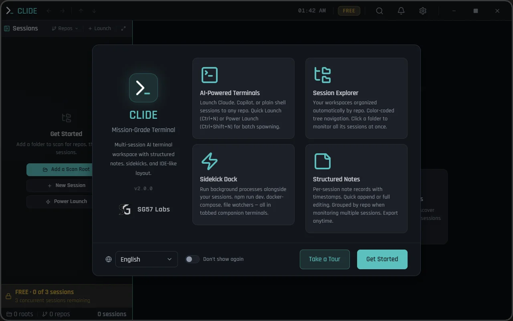

# CLIDE

**Mission-Grade Terminal**

Multi-session AI terminal workspace with structured notes, sidekicks, and IDE-like layout.

[Download for Windows](https://github.com/SG57/clide-releases/releases/latest) · [Website](https://sg57.dev/clide)

 

---

Run Claude Code, Copilot CLI, Aider, or any terminal tool — all from one cockpit.

CLIDE gives you Mission Control for concurrent AI terminal sessions. Launch dozens of agents, track them in a grid dashboard, attach background sidekicks, and keep structured notes — all without leaving the terminal.

## Download

| Platform | Installer | Portable |
|----------|-----------|----------|
| **Windows x64** | [CLIDE-Setup.exe](https://github.com/SG57/clide-releases/releases/latest) | [CLIDE-portable.exe](https://github.com/SG57/clide-releases/releases/latest) |

## Features

- **Multi-session terminals** — Launch and monitor dozens of concurrent sessions in a grid dashboard
- **Session Explorer** — Tree view organized by repo with color-coded navigation, pinning, and multi-select
- **Sidekick Dock** — Background companion terminals per session (npm run dev, file watchers, docker-compose)
- **Structured Notes** — Per-session note cards with timestamps, full-text search, and cross-session group view
- **Power Launch** — Batch-spawn sessions across repos with one command
- **Command Palette** — Keyboard-driven navigation for everything
- **Terminal Search** — Find text in any terminal with Ctrl+F
- **8 Languages** — English, Spanish, Japanese, German, French, Korean, Chinese, Portuguese
- **Auto-update** — Seamless background updates via GitHub Releases

## Pricing

| Free | Pro · $39 one-time |
|------|--------------------|
| 3 concurrent sessions | Unlimited sessions |
| 1 sidekick per session | Unlimited sidekicks (up to 50) |
| Freeform notes | + Structured notes |
| — | + Sidekick presets |
| — | + Priority support |

Machine-bound license, transferable with deactivation. No subscription.

## Links

- **Website:** [sg57.dev/clide](https://sg57.dev/clide)
- **Issues & feedback:** [Open an issue](https://github.com/SG57/clide-releases/issues)

## License

CLIDE is commercial software by [SG57 Labs](https://sg57.dev). Source code is proprietary.
Free tier available — Pro license unlocks all features.
